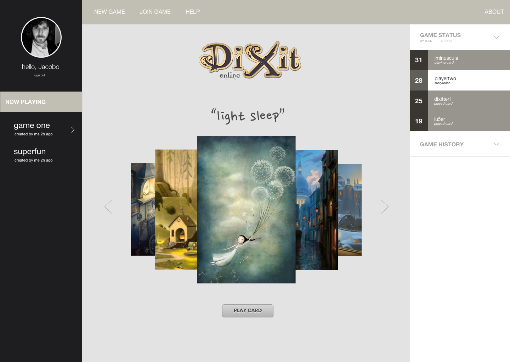

# Dixit online game

This project is a proof of concept of an online version of [Dixit](http://en.libellud.com/games/dixit), the acclaimed board game.

## Game overview

Dixit provides a set of abstract illustrations that players need to describe. Each turn one player will be the _storyteller_, who secretly chooses one of their dealt cards and announces its description —this can be a word, a phrase, a related thought, etc. The rest of the players choose the card from their hand that best resembles the provided description, and all the cards are mixed before being revealed.

Once the cards are displayed, each player except the storyteller vote on which one they think is the original card that matches the description. Players will be confused, since ideally everybody will have chosen an illustration that somehow resembles that thought. The storyteller must not provide a description that is too obvious, since they won't get any points if all players guess their card. On the other hand, if they are succinct enough for someone to guess their illustration, they will be awarded *3 points*. Players who correctly guess are also awarded *3 points*, plus *1 additional point* if any player votes their card.

So the scoring is:
  * 0 points for the storyteller if everybody guesses their card
  * 3 points for the storyteller if someone, but not everybody, guesses their card
  * 3 points for players who correctly guess the storyteller's card
  * +1 points for player who provided a card that is chosen by any other player.

The game ends when all cards have been dealt.

# About this project

Dixit-Online provides both a server implementing a *Game API* and a *Web Client* for players to join games and play.

The API allows the games to be played asynchronously, so players may participate in a game at different times. A user may be a player in more than one game simultaneously.

The client is still being developed.

# Technology

The API backend is based on [Django](https://djangoproject.org) and the client is an [Angular 2](https://angularjs.org) application.

# Running the Server

Requirements:
  * Python 3.5

1. Clone this repository

    `$ git clone git@github.com:jminuscula/dixit-online.git`

2. Access the server folder

    `$ cd dixit-online/server`

3. Create a new Python virtual environment

    `$ pyvenv-3.5 env`

4. Activate the virtualenv

    `$ source env/bin/activate`

5. Install Python dependencies

    `$ pip install -r requirements.txt`

6. Create database

    `$ ./src/manage.py migrate`

7. Sync available cards

    `$ ./src/manage.py sync-cards`

8. Run application server

    `$ ./src/manage.py runserver`

# Running the Client

Coming soon!

# Copyright

This is a proof of concept and is not meant to be distributed or sold. Illustrations may be protected by Copyright; we do not own any rights to them. If interested in an illustration, please refer to [our source](https://es.pinterest.com/search/pins/?0=dixit%7Ctyped&1=card%7Ctyped&q=dixit%20card&rs=typed).
